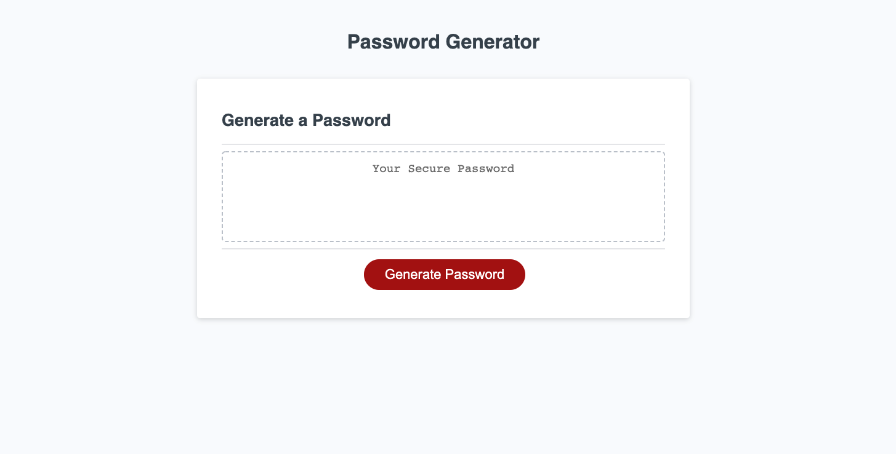

# Password Generator
by: Yonas Woldemichael

## Table of Contents
- [Description](#description)
- [Installation](#installation)
- [Visuals](#visuals)
- [Usage](#usage)

## Description
In this assignment we were instructed to randomly generate a password that meets certain criteria to create a strong password and provide greater security. Those critera points were:

- A length of at least 8 - 128 characters
- Prompts that ask the user if they would like the following:
    - Uppercase
    - Lowercase
    - Special Characters
- The imput will then be validated with atleast one character type being selected

## Installation
To external installation was required as vanilla javascript was used in this.

#

## Visuals
The page has a simple layout.

The following is a screenshot of the app.

## Usage
The usage of the site was to generate a random password after prompted questions asking what type of characters you would like to include in the password

[Link to the deployed site](https://ybyonas1.github.io/password-generator/)

[Link to the Github site](https://github.com/Ybyonas1/password-generator)

### Assignment by - Yonas Woldemichael